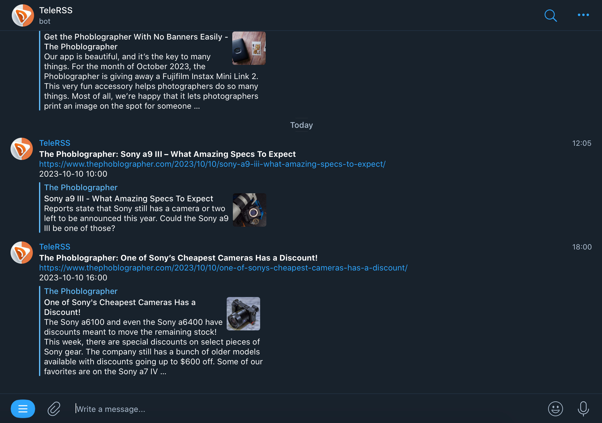

# TeleRSS - Telegram RSS Feed Aggregator Bot

TeleRSS bot is the most convenient way of subscribing to RSS feeds and receiving updates from them in Telegram.

## Features

- Runs in [CloudFlare Workers](https://workers.cloudflare.com/), you can create your own private bot instance for free
- Supports multiple users
- Use Telegram chats as feeds, subscribing multiple RSS feeds to a single chat

## Supported commands

- `/start` - start the bot
- `/help` - show help
- `/list` - list all feeds
- `/sub <url>` - subscribe to a new RSS feed
- `/unsub <url>` - unsubscribe from an RSS feed
- `/unsub_all` - unsubscribe from all RSS feeds

## Using a public bot instance

_**Privacy and security** warning: the bot instance will have access to the chat where you add it. Your subscriptions will be stored in a Key-value store shared with other users. If the public bot instance is compromised, your subscriptions may be leaked or lost. If you need more privacy and security, install your own bot instance instead._

1. Add [@TeleRSS bot](https://t.me/TeleRSS) to your Telegram chat
2. Send `/start` command to the bot
3. Send `/help` to see he list of available commands

## Deploying your own bot instance to CloudFlare Workers

### CloudFlare Worker deployment

1. Create a new CloudFlare account if you don't have one yet.
2. Log into [CloudFlare dashboard](https://dash.cloudflare.com).
3. Follow the [Get started guide](https://developers.cloudflare.com/workers/get-started/guide/) to get started with the app via Wrangler.
4. Clone this repository into your CloudFlare worker app.
5. Copy `wrangler.example.toml` to `wrangler.toml` and fill in the values.
6. Deploy the bot: `npm run deploy`

### Setting up a new Telegram bot

1. Create a new Telegram bot using [@BotFather](https://t.me/BotFather).
2. Copy the bot token and paste it into a `TELEGRAM_TOKEN` environment variable, which you can set in the CloudFlare dashboard -> Workers & Pages -> <your worker> -> Settings -> Variables.
3. Generate a secret token of 8-256 characters (only alphanumeric dash and underscore are allowed), e.g. `kasD2198casdS12kd`, and paste it into a `SECRET_TOKEN` environment variable similar to previous step.
4. Register the Telegram Webhook by editing a special URL `https://api.telegram.org/bot<your bot token>/setWebhook?url=<your worker url>&secret_token=<secret token you generated above>` and opening it in the browser.
